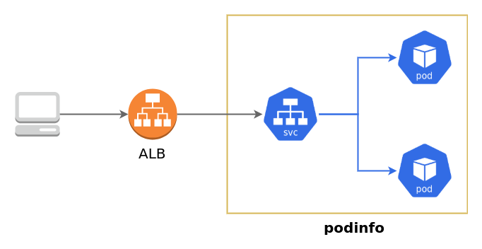

# Deploy Application
**The goal of this chapter is to deploy an application in EKS that will only run on Fargate.**

We will be using the application [podinfo](https://github.com/stefanprodan/podinfo) to try out Fargates functionality. Podinfo is a small web application that showcases best practices of running microservices in Kubernetes. Podinfo provides manifests that can be used with [kustomize](https://github.com/kubernetes-sigs/kustomize) which we will use, but we will make some small changes to those manifests so that we can easily get external access to the service.


We will first deploy the podinfo application onto our EC2 worker nodes to get a baseline. Apply the EC2 Kustomize manifests to the cluster.
```shell
cd 2_deploy_application
kubectl apply -k ec2
```

There should now be two pods running in the cluster in the default namespace.
```shell
kubectl get pods
```

Get the external IP of the podinfo service.
```shell
kubectl get service -l app=podinfo -o=jsonpath="{.items[0].status.loadBalancer.ingress[0].hostname}"
```

Copy the external IP and paste it into you browser. You should get a page that looks like something below. It may take some time for the load balancer to be accessible so be patient.


If you can reach the page it means that your pods are running and are accessible, but it they are not running on Fargate. Remember that our cluster has both EC2 nodes and a Fargate profile. When we created the Fargate profile we set the selector to both the namespace `default` and the label `env: fargate`.

Change the deployment so that the pod gets the correct label to fit the Fargate profile selector.
```shell
kubectl apply -k fargate
```

The only difference is that we are adding a label to the pod template, causing the pods to be re-scheduled with the labels.
```yaml
apiVersion: apps/v1
kind: Deployment
metadata:
  name: podinfo
spec:
  template:
    metadata:
      labels:
        env: fargate
```

We can now verify that the podinfo pod is running on Fargate by getting the name of the node and comparing it to the nodes present in the cluster. The node name will have the prefix `fargate` and also have labels added to it by EKS indicating its compute type. Get name of the node the pod is running on and get the value of the compute type label.
```shell
NODE_NAME=$(kubectl get pods -l app=podinfo -o=jsonpath="{range .items[*]}{.spec.nodeName}{'\n'}{end}")
echo $NODE_NAME
kubectl get node $(echo $NODE_NAME) -o=jsonpath="{range .items[*]}{'compute-type: '}{.metadata.labels['eks\.amazonaws\.com/compute-type']}{'\n'}{end}"
```

If you have done everything right the third command should return the value `compute-type: fargate` indicating that the compute type of the node the pod is running on is Fargate. You can also try to re-apply the EC2 manifests and check the node name of the pods after they have started.

The observant of you may have realised that new nodes have been added to the cluster, more specifically there is now a node for each of the pods running on Fargate. This is because unlike conventional Kubernetes nodes, Fargate has a 1:1 relationship between pods and nodes. This fact should to a certain degree be expected, as the containers need to be sandboxed from eachother. There are pros and cons to this approach, but thing is certain there are side-effects to this approach, as the freedom to control the runtime environment is decreased.

|     | Fargate | Managed Nodes |
| --- | --- | --- |
| **Units of work** | Pod | Pod and EC2 |
| **Unit of charge** | Pod | EC2 |
| **Host lifecycle** | There is no visible host | AWS |
| **Host AMI** | There is no visible host | AWS vetted AMIs |
| **Host:Pods** | 1:1 | 1:many |


Before moving on to the next chapter make sure to delete the podinfo resources that you have created.
```shell
kubectl delete deployment podinfo && kubectl delete service podinfo
```

[Next Chapter](../3_fargate_profile)

