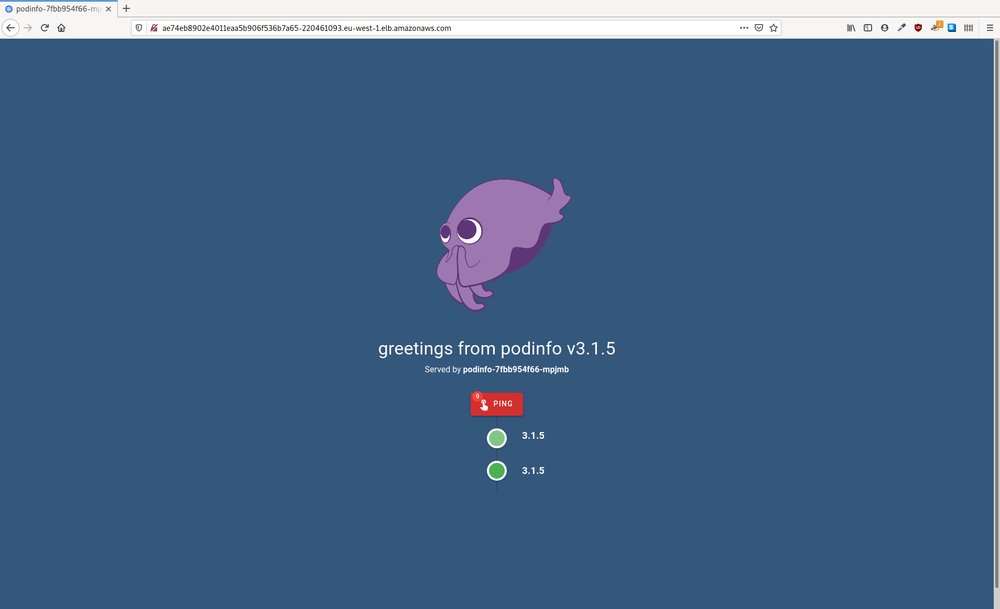

# Deploy Application
**The goal of this chapter is to deploy an application in EKS that will only run on Fargate.**

We will be using the application [podinfo](https://github.com/stefanprodan/podinfo) to try Fargates functionality. Podinfo is a small web application that showcases best practices of running microservices in Kubernetes. Podinfo provides a method to install it with [kustomize](https://github.com/kubernetes-sigs/kustomize) which we will use, but we will make some small changes to those manifests so that we can easily get an external ip to the loadbalancer.


We will first deploy the podinfo application onto our ec2 worker nodes to get a baseline. Apply the EC2 kustomize manifests to the cluster.
```shell
kubectl apply -k ec2
```

There should now be two Pods running in the cluster.
```shell
kubectl get pods
```

Get the external ip of the podinfo service.
```shell
kubectl get service -l app=podinfo -o=jsonpath="{.items[0].status.loadBalancer.ingress[0].hostname}"
```

Copy the external ip and paste it into you browser. You should get a page that looks like something below. It may take some time for the load balancer to be accessible so be patient.


If you can reach the page it means that your pods are running and accessible, but it doesnt mean that they are running on Fargate. Remember that our cluster has both EC2 nodes and Fargate profiles, and when we created the Fargate profile we set the selector to both the namespace `default` and the label `env: fargate`.

Lets change the deployment so that the pod gets the correct label to fit the Fargate profile selector.
```shell
kubectl apply -k fargate
```

The only difference is that we are adding a label to the deployment template, causing the pods to be re-scheduled with the labels.
```yaml
apiVersion: apps/v1
kind: Deployment
metadata:
  name: podinfo
spec:
  template:
    metadata:
      labels:
        env: fargate
```

We can now verify that the podinfo pod is running on Fargate by getting the name of the node and comparing it to the nodes present in the cluster.
The node name will have the prefix `fargate` and also have labels added to it by EKS indicating the compute type. So lets get name of the node the pod is running on and get the value of the compute type label.
```shell
NODE_NAME=$(kubectl get pods -l app=podinfo -o=jsonpath='{.items[0].spec.nodeName}')
echo $NODE_NAME
kubectl get node $NODE_NAME -o=jsonpath="{.metadata.labels['eks\.amazonaws\.com/compute-type']}"
```

If you have done everything right the second command should return the value `fargate` indicating that the compute type of the node the pod is running on is Fargate. You can also try to re-apply the ec2 manifests and check the node name of the pods after they have started.

The observant of you may have realised that new nodes have been added to the cluster, more specifically 2 new nodes have been added to the cluster. This is different from how other traditional Kubernetes clusters work as there now is a 1:1 relationship between the pod and node, compared to a n:1 relationship if we were only using EC2 worker nodes.

|     | Fargate | Managed Nodes |
| --- | --- | --- |
| **Units of work** | Pod | Pod and EC2 |
| **Unit of charge** | Pod | EC2 |
| **Host lifecycle** | There is no visible host | AWS |
| **Host AMI** | There is no visible host | AWS vetted AMIs |
| **Host:Pods** | 1:1 | 1:many |


[Next Chapter](../3_pod_resources)

