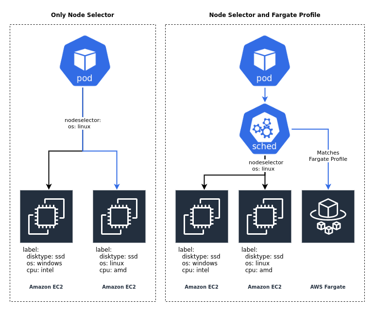

# Fargate Profile
**The goal of this chapter is to understand how Fargate Profiles are used by the pod scheduler.**

Fargate Profile allows an administrator to declare which pods run on Fargate. This declaration is done through the profile's selectors. Each profile can have up to five selectors that contain a namespace and optional labels. You must define a namespace for every selector. The label field consists of multiple optional key-value pairs. Pods that match a selector (by matching a namespace for the selector and all of the labels specified in the selector) are scheduled on Fargate. If a namespace selector is defined without any labels, Amazon EKS will attempt to schedule all pods that run in that namespace onto Fargate using the profile. If a to-be-scheduled pod matches any of the selectors in the Fargate profile, then that pod is scheduled on Fargate. The following parameters are part of a Fargate Profile.
```json
{
  "fargateProfileName": "",
  "clusterName": "",
  "podExecutionRoleArn": "",
  "subnets": [
    ""
  ],
  "selectors": [
    {
      "namespace": "",
      "labels": {
        "KeyName": ""
      }
    }
  ],
  "clientRequestToken": "",
  "tags": {
    "KeyName": ""
  }
}
```

The Fargate profile works slightly differently compared to using [node selectors and node labels](https://kubernetes.io/docs/concepts/configuration/assign-pod-node/) as there is no extra configuration to the pod. A cluster with a Fargate profile may schedule the pod on Fargate while a similar EKS cluster without a Fargate profile will not if the pod is running in the same namespace. Behavior like this has its benefits as the same manifests in multiple environments, at the same time the behavior may seem a bit invisible as you would need to check the EKS configuration to see how to run a pod on Fargate. For more information please refer to the [documentation](https://docs.aws.amazon.com/eks/latest/userguide/fargate-profile.html).


## New Namespace
Now we want to add a new namespace where all pods will run on Fargate.

Create a new namespace and deploy a pod in it.
```shell
kubectl create namespace test
kubectl apply -f test-pod.yaml
```

Fargate profiles are immutable so we need to add a new Fargate Profile to include the new namespace. The following Fargate Profile will be added.
```yaml
- name: test
  selectors:
    - namespace: test
```

Update the cluster with the new modified cluster configuration files.
```shell
eksctl create fargateprofile -f new-namespace-cluster.yaml
```

The pod will not run on Fargate until it is re-scheduled. Delete the pod and create it again to reschedule the pod.
```shell
kubectl -n test delete pod test
kubectl apply -f test-pod.yaml
```

The pod is now runnin on Fargate. It is important to understand that EKS on Fargate only extends the scheduler in Kubernetes and does not alter it. In the same way that a pod will not be rescheduled if the node selector no longer matches after a nodes labels have been altered, a pod will not be moved to run on Fargate if the profile is created after the pod has been scheduled.

Delete the pod and the Fargate Profile.
```shell
kubectl -n test delete pod test
eksctl delete fargateprofile --name test -f new-namespace-cluster.yaml
```

## Pod Execution Role
When your cluster creates pods on AWS Fargate infrastructure, the pod needs to make calls to AWS APIs on your behalf, for example, to pull container images from Amazon ECR. The Amazon EKS pod execution role provides the IAM permissions to do this. This does however mean that it is currently not possible to use any private registry other than ECR as the source of images, as there is no private registry support like there is in [ECS](https://aws.amazon.com/blogs/compute/introducing-private-registry-authentication-support-for-aws-fargate/).

It is important to not confuse the pod execution role with a container role. In ECS there is a Task Execution Role and a ECS Task Role (or Container Role), one enables IAM permissions while creating the container and the other permissions for the container itself. Currently no such solution exists for EKS so one would have to continue using solutions like [kube2iam](https://github.com/jtblin/kube2iam).

[Next Chapter](../4_pod_resources)

