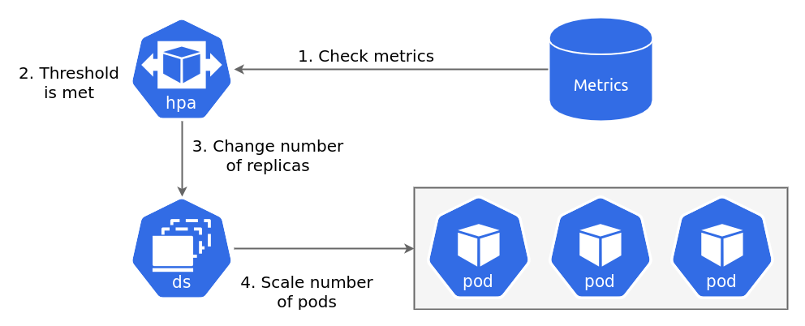

# Autoscaling
**The goal of this chapter is to set up autoscaling for pod running on Fargate**

Now that we understand how resource allocation works with EKS on Fargate its about time we look into autoscaling. Autoscaling is a major selling point of both Kubernetes and cloud providers. Within Kuberntes there are three different types of scaling. Cluster autoscaling adds nodes to the cluster when there are not enough resources availible on the nodes to fullfill the requests. Horizontal pod autoscaling (HPA) scales the number of pods based on CPU utilization or any other custom metric. Vertical pod autoscaling (VPA) will automatically set and change the resource limits and requests for a pod based on its historical resource usage. It should be noted that at the moment HPA and VPA can not be used in tandem on the same pod.

By now it should be obvious that the cluster autoscaler is not applicable to Fargate. The main selling put of using Fargate with EKS is the fact that there are no nodes that have to be scaled. Resources are requested by the pod and they are immediatly available. Both HPA and VPA depends on metrics-server to work, which we have already used in the previous chapter. So it should work without any issue, you haven't removed the metrics-server right?

## HPA
HPA works by creating a separate resource that defines among others a target deployment, max and min amount of replicas, and the target metric that should tragger a scaling event. The metrics can either come from the metrics-server running in the cluster or be a custom metric that has been collected by Prometheus.


We will be using the resource-consume application once again, but this time we will also create a HPA to go along with the deployment. For this example we have configured the HPA to scale when the memory usage exceeds 50% of the memory request.
```yaml
apiVersion: autoscaling/v2beta2
kind: HorizontalPodAutoscaler
metadata:
  name: resource-consumer
spec:
  scaleTargetRef:
    apiVersion: apps/v1
    kind: Deployment
    name: resource-consumer
  minReplicas: 1
  maxReplicas: 10
  metrics:
  - type: Resource
    resource:
      name: memory
      target:
        type: Utilization
        averageUtilization: 50
```

Apply the resource consumer application with the HPA.
```shell
kubectl apply -k resource_consumer_hpa
kubectl wait --for=condition=available deployment/resource-consumer
```

Consume resources to cause the trigger the HPA and increase the amount of pods.
```shell
EXTERNAL_IP=$(kubectl get service -l app=podinfo -o=jsonpath="{.items[0].status.loadBalancer.ingress[0].hostname}")
curl --data "megabytes=300&durationSec=180" http://$EXTERNAL_IP:8080/ConsumeMem
```

After about a minute you should see the HPA kick in and increase the replica count of the deployment. Then when the memory consumption stops we should see the HPA scale back the deployment by decreasing the replica count. Rather uneventful if you have used the HPA before, but the cool part is that this could scale forever (until the soft limit of 100 pods per region or the hard limit of 5000 pods per cluster).

[Next Chapter](../5_limitations)
